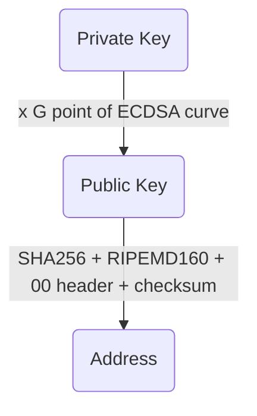
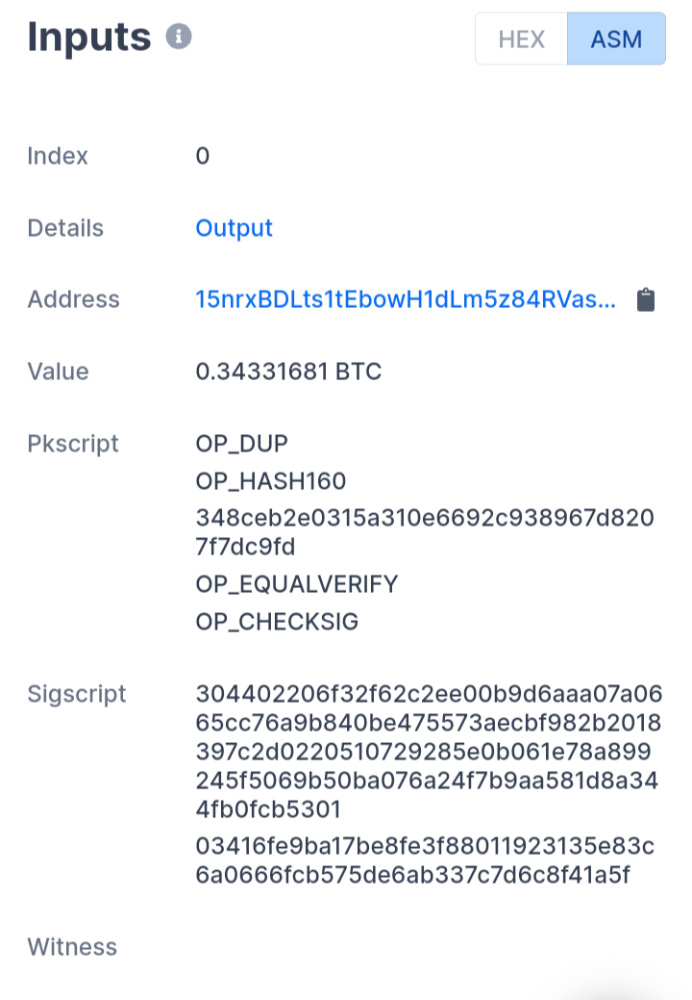
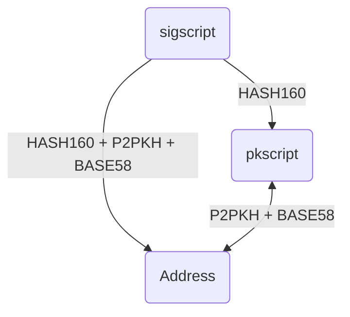
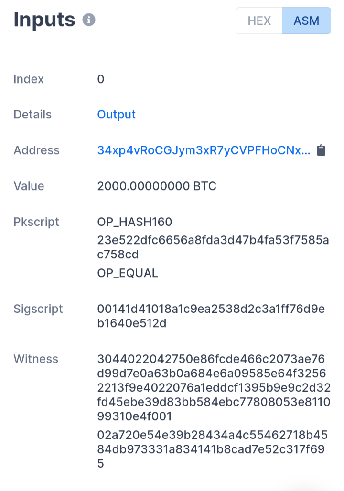
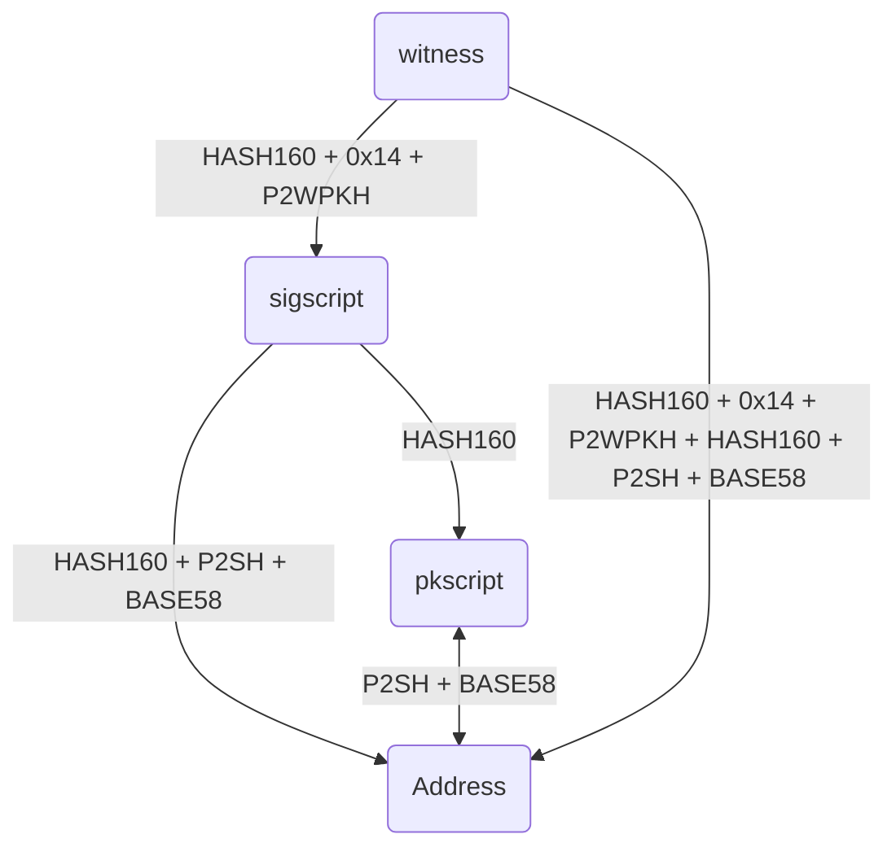

# BitcoinEcdsa

I created this code from the one of [kamsec](https://github.com/kamsec/simple-btc-address) to fully understand how keys and addresses checks are implemented in bitcoin cryptocurrency chain.

This code is written in python (version 3.7 or higher) with no other dependencies than :
  * hashlib
  * base64 : for keys and address generator only 
  * secret: for keys and address generator only if random number is not provided 

There is two files for two different learning purposes:
  * A keys and addresses generator: to learn how ECDSA bitcoin keys and Wallet addresses are computed 
  * A transaction keys and addresses checker to see how, in an actual transaction in the bitcoin chain, adresses are checked regarding public key (and were is this public key). For this, two different transactions have been used : [one using Witness](https://www.blockchain.com/btc/tx/01e7c525a5759cde1d04d2e9a363424053ace3ff1d2dde9cd1b368493254bd0d) (feature added in 2017) and [another one](https://www.blockchain.com/btc/tx/56beef8afe5a4b5b41225211e62c3e7bce5747c4c8dcdd982173e8496687794b) not using it.

I commented this code as much as possible to ease its understanding.

If you speak French, I also wrote an [article](https://olivierrt.wordpress.com/2022/06/04/comprendre-le-fonctionnement-des-blockchaines-et-des-crypto-monnaies-comme-le-bitcoin/) explaining how bitcoin Blockchain works with no more required prerequisite than how we divide and multiply integer numbers by hand.

## Bitcoin keys and address generator 

Bitcoin keys and address generator is intended to provide python code corresponding to the following transformations:



Well note than two versions of keys can be used:
  * Uncompress keys : which means, for:
    * Private key : without 01 suffix
    * Public key : with both X and Y coordinates
    * Address:  computed from uncompressed public key
  * Compressed keys : which means, for:
    * Private key : with 01 suffix
    * Public key : wiithout Y coordinate, but with a bit to indicate on which of the two ECDSA curve branches the public point is
    * Address : computed from compressed public key  

Here is an example of the output of the keys and address generator:

```
--------------PRIVATE KEY--------------
Private key (int):
 92657199688716122261466102625185388969051379234462582952227375888034518477067
len: 77
Private key (hex):
 CCDA1DD5E899013F311F0142C04461B5F42B09B883F4B3FC4C9182118B77290B
len: 66
Private key (base64):
 zNod1eiZAT8xHwFCwERhtfQrCbiD9LP8TJGCEYt3KQs=
len: 46
Private key (wallet import format WIF):
 5KNWFXqTZDQyeuB5oZ777Wej7eTEkTbsJS4ckt9RS9KjxTjUhcG
len: 53
Compressed (i.e.with suffix) Private key (wallet import format WIF):
 L45v796tDBnq4HHWCUhwyjsWtLJogpQu1wcxpgkAqyjibKj8QsDL
len: 54
--------------PUBLIC KEY--------------
Public point:
 (16460141925263873630197708627070794227009898992334504311226232642993352063120, 20324828233806308062661556219551636594936498606957474881854980113567382133088)
Public key (uncompressed):
 0424641C34B42A0B41E6C196AFA339FA7D0F83A09F85FF89AC130024B4C4E3B8902CEF71F2F70A0E0584D4DB4DAEEF6655A96BFEF0BBB2C6C7BAC3C67F2D925960
 len: 130
Public key (compressed, i.e. prefix replaced and Y coords removed) hexadecimal:
 0224641C34B42A0B41E6C196AFA339FA7D0F83A09F85FF89AC130024B4C4E3B890
len: 68
Public key (compressed integer):
 248044320399896264477339678644446609933549868323615632390141400658819611342992
len: 78
--------------ADDRESS--------------
Uncompressed (from uncompressed public key) bitcoin address in Wallet Import Format WIF :
 1NZYpaGjiLWTpsR5Ea2ZnKJUDMyPHKjhZ2
len: 36
Compressed (from compressed public key) bitcoin address (int):
 2811614295445978308437944984419949860133198666647273862498
len: 58
Compressed bitcoin address (base58) in Wallet Import Format WIF:
 1BTJRxW43y3oVfDiZtAQXL8f9E8zjRmird
len: 36
---------------------------------------
```

## Bitcoin key and address transaction checker 

Bitcoin keys and address transaction checker is intended to provide python code corresponding to two common examples of bitcoin transaction implementations.

As bitcoin transactions are defined in bitcoin script, their implementation can be whatever we want. In practices, they correspond to a limited number of cases. 

Here are two of these cases (which are very common):

N.B.
  * "pkscript" in the diagrams below don't designate the actual script, but the main value provided in it.
  * "sigscript" in the diagrams below designate the second value contains in it, or the only value in it if there is only one.
  * P2PKH, P2SH and P2WPKH below designated respective version bytes : 0x00, 0x05 and 0x00, see [Addresses types](https://unchained.com/blog/bitcoin-address-types-compared/)
  * BASE58 below designate [base58](https://en.bitcoin.it/wiki/base58_encoding) encoding and concatenation of a checksum
  * HASH160 below designate SHA256 hashing on which RIPEMD160 hashing has been applied 
  * "+" below designate a concatenation operation or the application of BASE58 or HASH160 algorithm
  * "0x14" correspond the the length in bytes of HASH160 result: 160 bits / 8 bits = 20 bytes = 0x14

### Without witness : With Pubkey Hash





### With witness : With Script Hash





### Code output 

Here is the output of the transaction checker script:

```
------ transaction without witness ---------
__ inputs:
sigscript pubkey :
 03416fe9ba17be8fe3f88011923135e83c6a0666fcb575de6ab337c7d6c8f41a5f
 validates address :
15nrxBDLts1tEbowH1dLm5z84RVas7USmP
= True
hash160 of sigscript pubkey:
 348ceb2e0315a310e6692c938967d8207f7dc9fd
 validates pkscript :
 348ceb2e0315a310e6692c938967d8207f7dc9fd
 = True
pubkeyScript :
 348ceb2e0315a310e6692c938967d8207f7dc9fd
 validates address :
15nrxBDLts1tEbowH1dLm5z84RVas7USmP
= True
__ output:
pubkeyScript of output :
 07628bb59790a53711f3e9caddaa7eed89663935
 validates address :
1g3nRQhpVo8vh6AFeGTBVkHaD9esmk8Vj
= True
------ transaction with witness ---------
__ inputs:
hash160 of sigscript:
 23e522dfc6656a8fda3d47b4fa53f7585ac758cd
 validates pkscript :
 23e522dfc6656a8fda3d47b4fa53f7585ac758cd
 = True
base58 of hash160 of sigscript:
 34xp4vRoCGJym3xR7yCVPFHoCNxv4Twseo
 validates address :
 34xp4vRoCGJym3xR7yCVPFHoCNxv4Twseo
 = True
base58 of hash160 of pubKey from witness :
 34xp4vRoCGJym3xR7yCVPFHoCNxv4Twseo
 validates address :
 34xp4vRoCGJym3xR7yCVPFHoCNxv4Twseo
 = True
```
